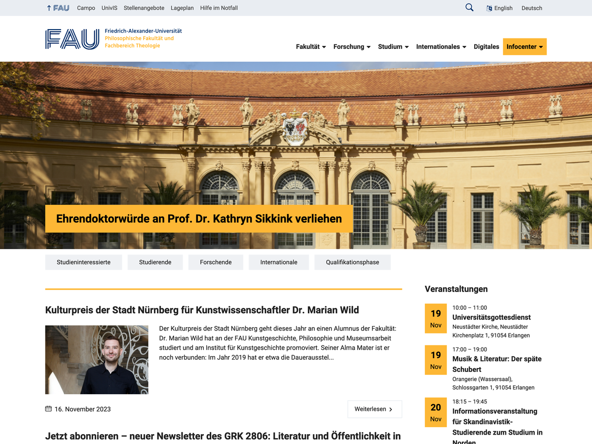

# FAU-Philfak

  

WordPress-Theme für die Philosophische Fakultät der Friedrich-Alexander-Universität Erlangen-Nürnberg (FAU)

## Screenshot

## Download 

GitHub-Repo: https://github.com/RRZE-Webteam/FAU-Philfak

## Autor 
RRZE-Webteam , http://www.rrze.fau.de

## Copyright

GNU General Public License (GPL) Version 3

## Dokumentation

Eine Dokumentation des Themes und dessen Funktionen findet sich unter der Adresse
https://wp.rrze.fau.de  

## Feedback

Bitte verwenden Sie GitHub um Issues oder Feedback zu geben:
 https://github.com/RRZE-Webteam/FAU-Einrichtungen/issues

Alternativ können Sie auch eine E-Mail senden an: 
 webmaster@rrze.fau.de

## Entwickler-Hinweise

Dieses Theme wurde als Klon des Themes [FAU-Einrichtungen](https://github.com/RRZE-Webteam/FAU-Einrichtungen/) erstellt.
Hierzu befindet sich in dem Original-Theme eine entsprechendes Gulp-Skript, mit dieses Theme und die anderen Fakultätsthemes der FAU erstellt werden können.
Informationen hierzu finden sich in der Dokumentation des Themes [FAU-Einrichtungen](https://github.com/RRZE-Webteam/FAU-Einrichtungen/).

